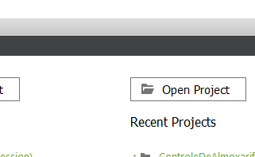
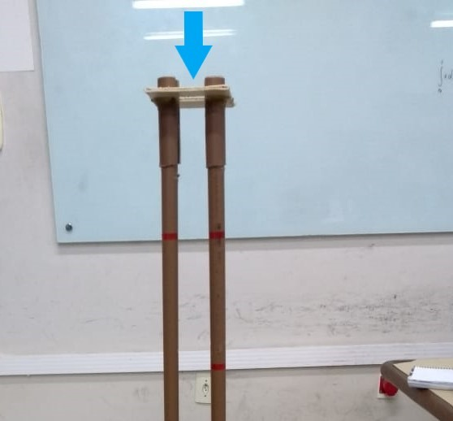

# Dispositivo-de-medicao-de-queda-livre

# Manual para utilização do experimento de medição de aceleração da gravidade utilizando conceitos de queda livre

Para utilizar o equipamento, primeiro você precisará baixar o código disponível neste link: ahchvajc, clique em download ZIP.
.png)
Figura 1
Em seguida descompacte o arquivo no seu computador e o abra no programa Qt Creator, basta clicar em “Open Project” e selecionar o .pro existente na pasta do arquivo.

Figura 2
Após feito isso, conecte o cabo USB ao seu computador e ao arduino nano.

Figura 3
Para dar inicio a aplicação, clique em “Run” no Qt Creator.

Figura 4
Por fim, lance o objeto do topo do equipamento, no espaço indicado abaixo:

Figura 5
E analise os gráficos gerados no computador.

